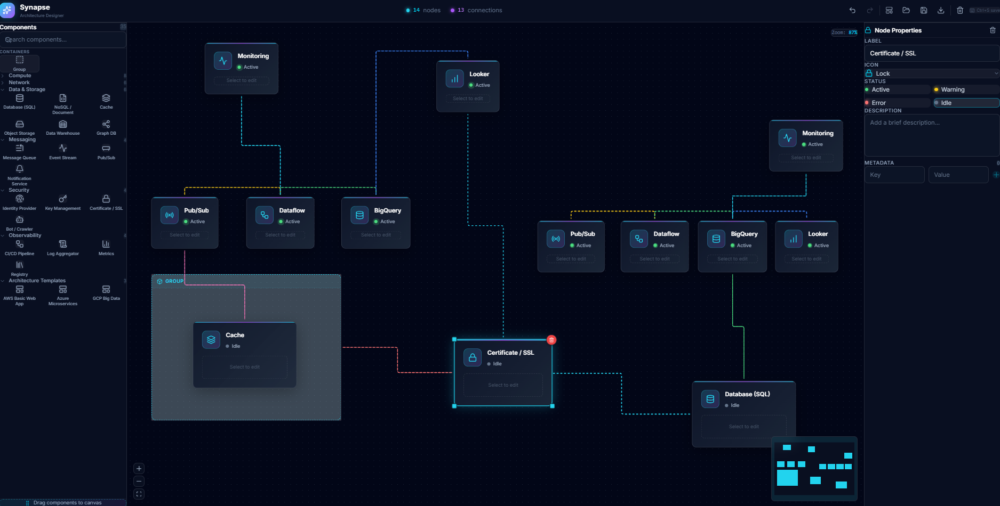

# Synapse

 



> A modern, local-first React application for creating interactive system architecture diagrams. Built with a **Sci-Fi/Glassmorphism** aesthetic, Synapse provides an intuitive drag-and-drop interface for designing and visualizing complex systems.

## Key Features

### Visual & UI
- **Infinite Canvas**: Pan and zoom freely across an unlimited workspace.
- **Glassmorphism Design**: Sleek dark mode UI with neon accents and blur effects.
- **Customizable Themes**: Toggle between Light and Dark modes (Coming Soon).
- **Group Containers**: Organize nodes into labeled, comprehensive groups with dashed borders.

### Components & Flow
- **Drag-and-Drop Library**: 60+ categorized icons (Cloud, Database, Security, etc.).
- **Smart Nodes**: Each node supports inputs/outputs, status indicators, and detailed metadata.
- **Flexible Connections**: Choose between **Bezier**, **Straight**, **Step**, or **Smooth Step** paths.
- **Templates**: Instantly load pre-built architectures (AWS, Azure, GCP, Microservices).

### Productivity
- **Context Menu**: Right-click to Duplicate, Delete, or control Z-Index (Bring to Front/Send to Back).
- **Undo/Redo**: Full history management with `Ctrl+Z` / `Ctrl+Y`.
- **Property Panel**: Real-time editing of node/edge properties side-by-side.
- **Auto-Save**: Automatic persistence to IndexedDB so you never lose work.
- **File Management**: Export and Import diagrams via `.syn` JSON files.

## Tech Stack

| Category | Technology | Description |
|----------|------------|-------------|
| **Core** | [React 18](https://react.dev/) | Component-based UI library |
| **Build** | [Vite](https://vitejs.dev/) | Next-generation frontend tooling |
| **Canvas** | [React Flow](https://reactflow.dev/) | Interactive node-based diagramming |
| **State** | [Zustand](https://zustand-demo.pmnd.rs/) | Minimalist state management |
| **Icons** | [Lucide React](https://lucide.dev/) | Beautiful & consistent open-source icons |
| **Styling** | [Tailwind CSS v4](https://tailwindcss.com/) | Utility-first CSS framework |
| **Storage** | [idb-keyval](https://github.com/jakearchibald/idb-keyval) | Promise-based IndexedDB wrapper |

## Getting Started

### Prerequisites
- Node.js 18+
- npm or yarn

### Installation

```bash
# 1. Clone the repository
git clone https://github.com/yourusername/synapse.git
cd synapse

# 2. Install dependencies
npm install

# 3. Start development server
npm run dev
```

The application will be available at `http://localhost:5173`

### Building for Production

```bash
npm run build
# Output will be in the `dist` folder
```

## Usage Guide

### Creating Your First Diagram
1. **Add Nodes**: Drag icons from the *Assets* sidebar onto the canvas.
2. **Group Items**: Drag a *Group Container* and place nodes inside it.
3. **Connect**: Drag from one node's handle (circle) to another.
4. **Customize**: Click a node or line to open the *Property Panel* on the right.
   - *Nodes*: Change labels, descriptions, and status (Active/Warning/Error).
   - *Edges*: Change color, style (Bezier/Step), and flow animation.

### Context Menu Actions
Right-click any node/group to:
- **Duplicate**: Clone the node and its data.
- **Bring to Front / Send to Back**: Adjust visual layering.
- **Delete**: Remove from canvas.

### Keyboard Shortcuts

| Shortcut | Action |
|----------|--------|
| `Ctrl + Z` | Undo |
| `Ctrl + Y` | Redo |
| `Ctrl + S` | Save / Export File |
| `Ctrl + O` | Open / Import File |
| `Delete` | Remove Selected |

## Project Structure

```bash
src/
├── components/         # React components
│   ├── edges/          # Custom connection lines (CustomEdge)
│   ├── nodes/          # Node types (ServiceNode, GroupNode)
│   ├── Canvas.tsx      # Main drawing area
│   ├── ContextMenu.tsx # Right-click menu
│   └── ...
├── config/             # Static configurations (templates, icons)
├── hooks/              # Custom hooks (useAutoSave)
├── lib/                # Utilities & persistence logic
├── store/              # Global state (Zustand + Temporal)
└── types.ts            # TypeScript definitions
```

## Contributing

Contributions are welcome!
1. Fork the repo
2. Create your feature branch (`git checkout -b feature/AmazingFeature`)
3. Commit your changes (`git commit -m 'Add some AmazingFeature'`)
4. Push to the branch (`git push origin feature/AmazingFeature`)
5. Open a Pull Request

## License
This project is licensed under the MIT License - see the [LICENSE](LICENSE) file for details.

---
*Built with ❤️ by Synapse Contributors*
